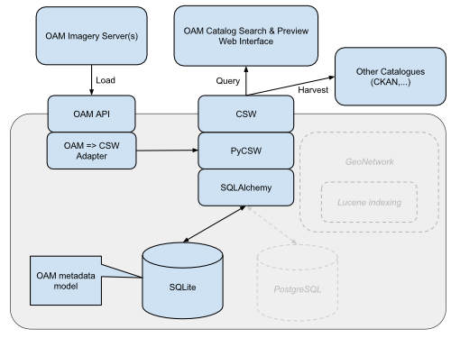

Technical Proposal
==================

`We have done something similar <http://geomati.co/dataportal/search-service.html#configuracion-de-gn-para-busqueda-por-variables>`_ before, using GeoNetwork plus Lucene indexing tweaks to adapt it to specific search needs. It's a powerful technical setup, on the paper.

But this time we would like to start with something simpler and as lightweight as possible: PyCSW on top of SQLite. We ensure a low entry barrier for both deployers and future maintainers: Less hardware requirements, less code lines to maintain. We can then introduce more advanced components as real needs demand it. For example, the centralized online catalog may switch to PostGIS instead of SQLite if the catalog grows to hundreds of thousands of records, while the "take away" versions could keep the database-in-a-file SQLite benefits.

The web client will query the catalog through the standard CSW protocol. No custom query API. Using a standard protocol decouples server from client implementations, and ensures reusability and interchangeability on both sides. Not RESTful, but standard. We shouldn't be scared of CSW because of the monstruosity of the ISO metadata model, or some not-so-usable catalog instances out there. The protocol is just a standard HTTP API.

We would start by validating the `OAM metadata model proposal <https://github.com/hotosm/OpenAerialMap/wiki/Metadata>`_, writing some reference metadata records based on real sample datasets. This will raise some questions and will let us refine the model, trying again to keep it as simple as possible: gather only the relevant metadata for our use cases. Then we can configure PyCSW to use the OAM metadata model, and load the reference records.

The web client will have:

* Search by text
* Filter by BBOX
* Filter by time range
* Paged results
* Footprint preview
* Data preview (for WMS or TMS services)

The web client will use the Javascript libraries and tools that helped us keep the code tidy in our past projects: RequireJS for modular development, Bootstrap for UI goodness, Grunt (maybe Gulp) for task automation, Bower for dependency management, Jasmine for tests. We can adapt to other toolsets used by the HOT developer community, but will avoid using intrusive frameworks or immature tools that condition our future flexibility or sustainability just because they are the last trendy tool (Javascript is a wild world). For instance, developing an AngularJS directive would feel like digging our own vendor lock-in trap.

A less clear area (because we never did it) is how to wrap Catalog instances in a "take away" package that can be deployed on emergency scenarios. But there are some Windows "Portable Python" projects, and we can pack all the python dependencies in a virtual environment. So there is a good chance we can make an USB-stick distributable without a need for an installer or the overhead of a Virtual Machine. That would be our first bet.

OAM API development and integration with other OAM components (namely, the data server(s)) depends heavily on third parties and we don't have enough information to make a detailed proposal. We will use a well established Python web framework to build the api (preferably Django, could be Pyramid, would avoid weaker Flask).

We propose to create a specific "OAM-Catalog" public GitHub repo belonging to hotosm organization, using the Wiki pages for proposals, the issues for specific tasks, and these first-level directories:

* "docs": The OAM-Catalog technical documentation, based on Sphinx ReStructuredText (could be rendered out to readthedocs.org).
* "OAM-C-service": The python service, including PyCSW as a submdule.
* "OAM-C-viewer": Search & Preview web interface.

And of course a gh-pages branch to setup a landing page with links to source code, documentation, distributables, maybe some tutorial materials, and contact info.

Any potential improvement to the CSW service should be commited to (or pull-requested to) the upstream official PyCSW repo.

Regarding communication, we propose to have a weekly meeting with the OAM Project Manager to keep in sync, quickly iterate over the ongoing tasks and take decisions. Having direct occasional contact with real users and their needs would be also very helpful.
